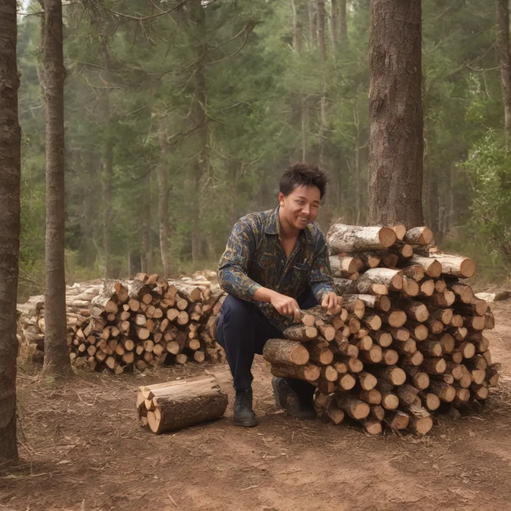
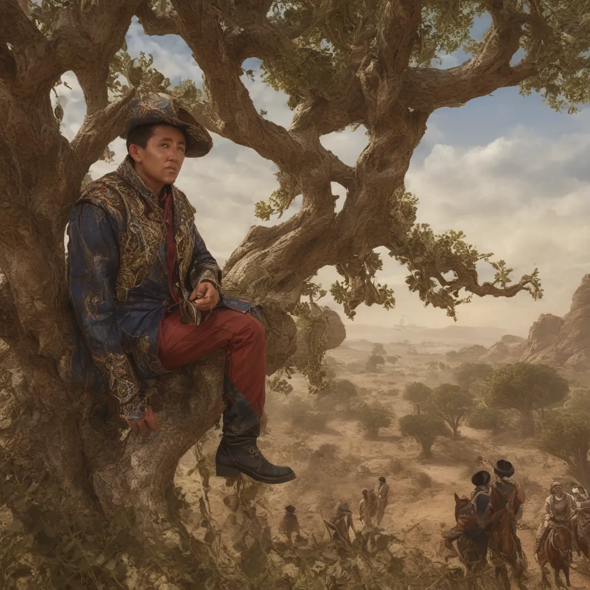
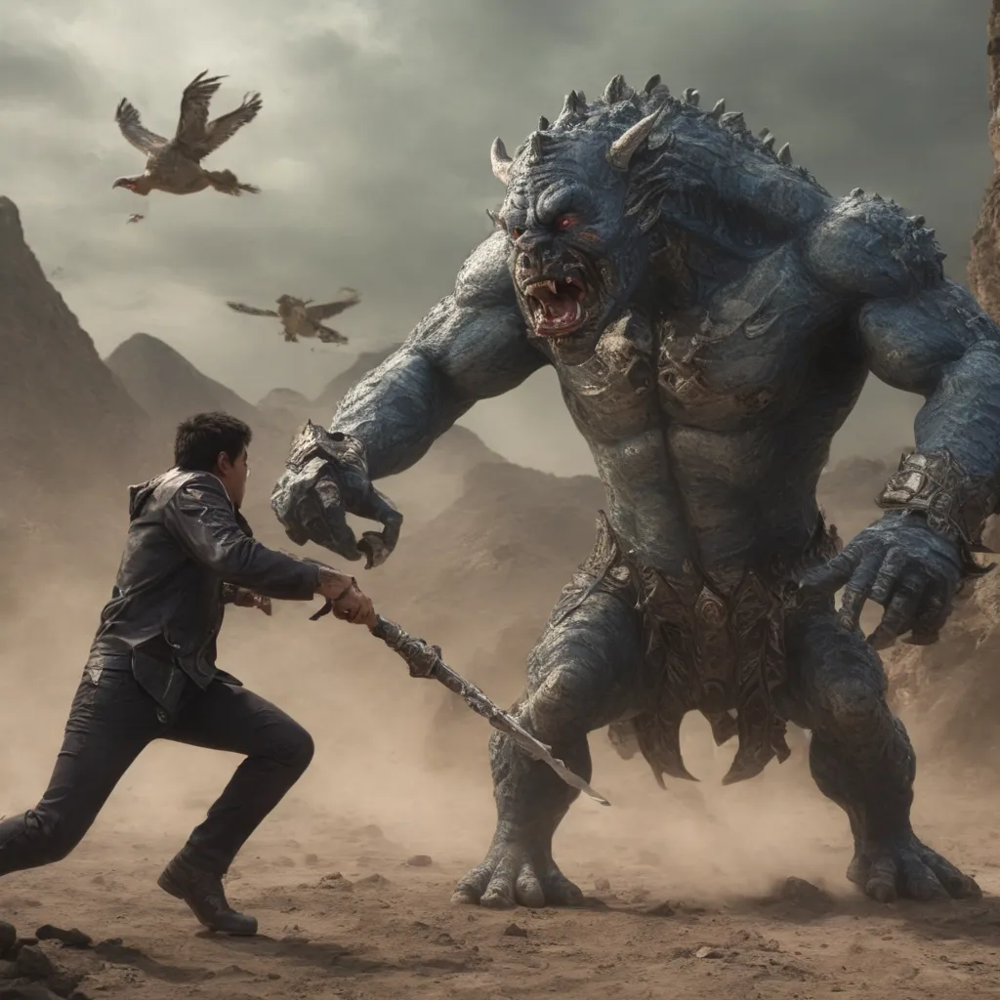
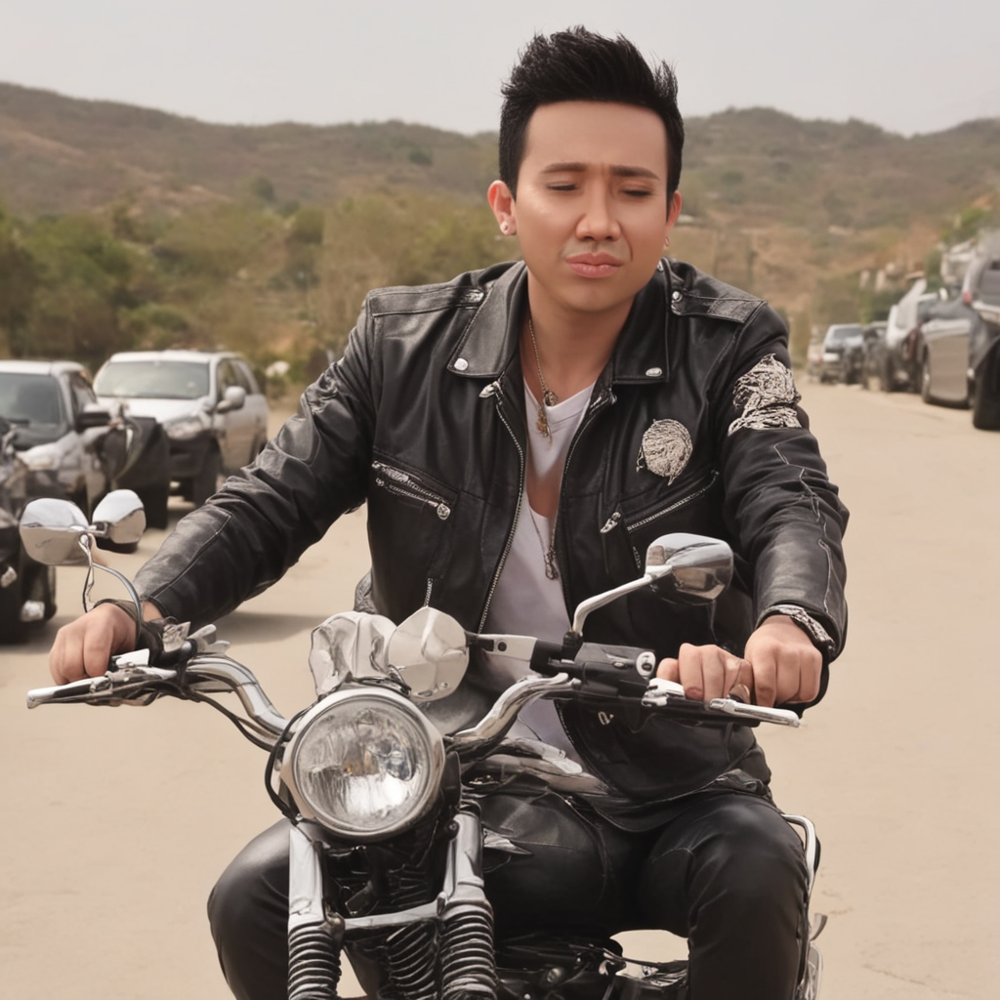
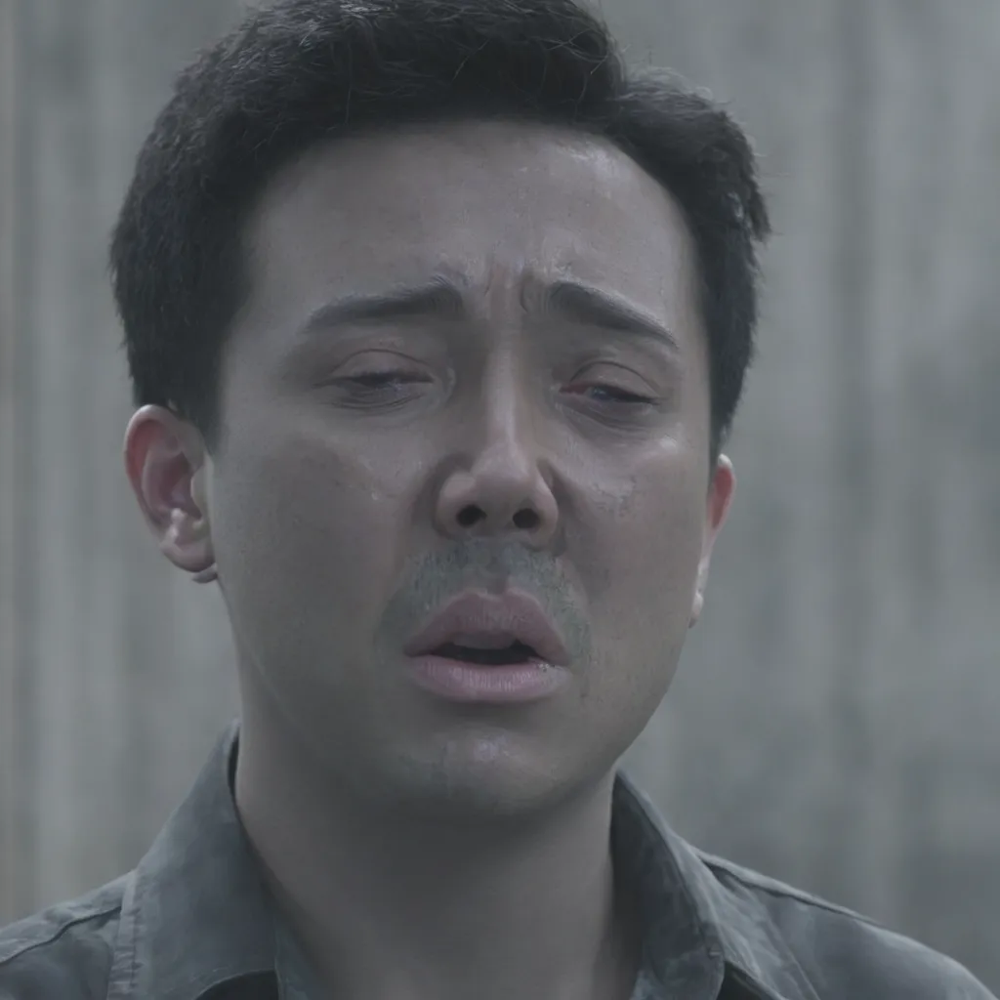
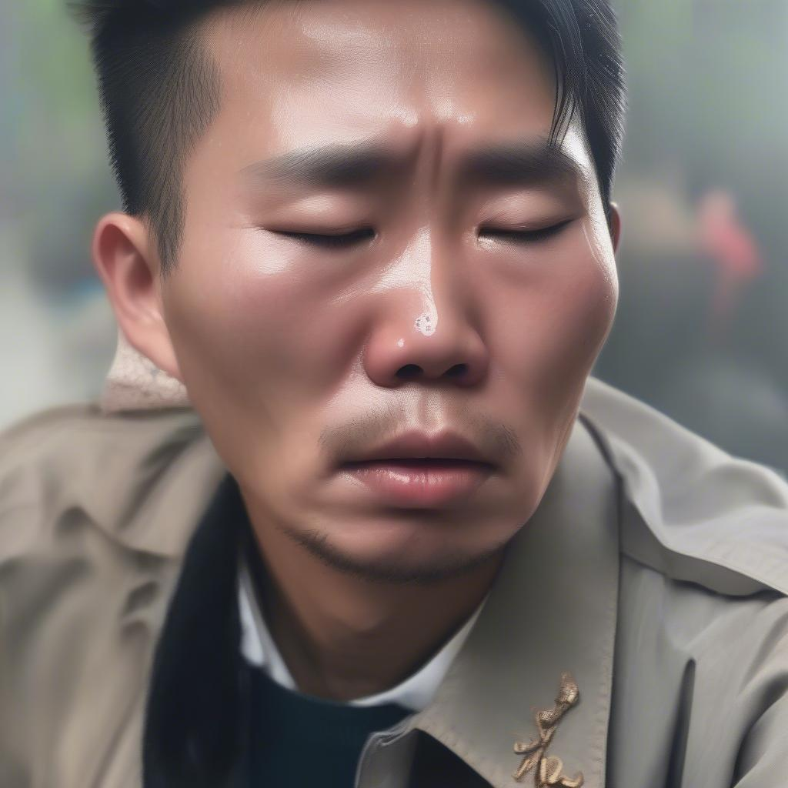

# Create your story with Trấn Thành!!!
## Giới thiệu
Content cho trẻ em là "vùng đất vàng" để khai thác. Nắm bắt được tâm lý thích sự quen thuộc của trẻ nhỏ, repo này giúp bạn tạo ra ảnh dựa trên những mẫu có sẵn, ví dụ như ảnh Trấn Thành (hoặc chính bạn) đang bay:


## Bài toán
- Stable Diffusion là một mô hình sinh ảnh mạnh mẽ cho các bài toán tổng quát nhưng thường gặp khó khăn trong việc tạo ra ảnh cho các miền tri thức đặc thù hoặc mang tính cá nhân hóa cao.
- Việc finetune lại toàn bộ mô hình rất tốn chi phí, hầu như không thể thực hiện được

## Phương pháp
Để giải quyết các vấn đề trên, em sử dụng mô hình Stable Diffusion XL kết hợp với các kỹ thuật tinh chỉnh như LoRa và DreamBooth.

### Stable Diffusion XL
Stable Diffusion XL có một số cải tiến so với phiên bản Stable Diffusion trước đó:
- Mạng Unet lớn gấp 3 lần, kết hợp hai bộ mã hóa văn bản (OpenCLIP ViT-bigG/14 và ViT-bigB/14) để tăng cường khả năng xử lý ngữ cảnh từ prompt.
- Sử dụng quy trình hai bước gồm mô hình cơ sở (base model) và mô hình tinh chỉnh (refiner model) để nâng cao chất lượng hình ảnh.

### LoRa
LoRa (Low-Rank Adaptation) vốn được sinh ra để finetune cho các mô hình LLM, nhưng đã được mở rộng để ứng dụng cho các mô hình Diffusion. 

Với Stable Diffusion, Cross Attention được dùng để liên kết thông tin từ prompt, giúp mô hình sinh ảnh theo đúng yêu cầu. Prompt đóng vai trò như Query, trong khi Representation của ảnh trong Latent Space là Key và Value.

Từ [các quan sát](https://arxiv.org/abs/2012.13255) rằng các mô hình LLM, mở rộng ra là Cross Attention nói chung thường có rank thấp, LoRa tận dụng phép phân rã ma trận (matrix decomposition) để tối ưu lượng tham số cần huấn luyện trong cơ chế Cross Attention. 

### DreamBooth
DreamBooth là một phương pháp cá nhân hóa mô hình Diffusion bằng cách huấn luyện nó với một lượng dữ liệu hình ảnh ít, giúp tái hiện một nhân vật hoặc phong cách cụ thể trong ảnh đầu ra.
Sử dụng DreamBooth, mô hình có khả năng tái tạo các yếu tố quan trọng của đối tượng (như màu sắc, hình dạng khuôn mặt, phong cách) một cách vô cùng nhất quán.
Chi tiết hơn về phương pháp có thể xem tại phần Tài liệu tham khảo.

## Demo
### Alibaba
- Hãy đến với câu truyện cổ tích "Alibaba và 40 tên cướp" cùng Trấn Thành:
  >Ali Baba was in the forest getting firewood.
He heard a clatter of hooves on the path. He was afraid. He climbed the nearest tree and hid.
He peeked out and saw forty men on horseback.
The forty riders reached a cliff. In the bright sunlight Ali Baba could see that their saddlebags were full of glistening and sparkling gold.“Those bags are full of stolen treasure!” he thought...

- Sử dụng các câu prompt sau, mô hình sẽ sinh ra ảnh tương ứng: 
  - ```a <TOK> person in the forest getting firewood```

  - ```a <TOK> person is hiding in a tree, watching men on horseback with treasure.``` 

  - ...

### Một số ví dụ khác
- Trấn Thành đánh nhau với quái vật:
    
    ```a <TOK> person is fighting a monster``` 

- Trấn Thành lái xe máy
    
    ```a <TOK> person is riding a motorbike``` 
    
    

- Sinh ảnh Trấn Thành khóc, với model finetune và SDXL:
  - ```a <TOK> person is crying``` (SDXL x LoRa)

  - ```Tran Thanh is crying``` (SDXL Base)


- ...
## Sử dụng
- Train model cho bộ dataset riêng (cần khoảng 20 mẫu): [load_trained.ipynb](https://github.com/ttb06/diffusers/blob/main/load_trained.ipynb)
- Load model đã huấn luyện, deploy bằng gradio: [load_trained.ipynb](https://github.com/ttb06/diffusers/blob/main/load_trained.ipynb)

## Hướng phát triển
- MergeLoRa: Có thể train các Adapter LoRa với từng usecase khác nhau (ví dụ: 1 LoRa cho ảnh Trấn Thành, và 1 LoRa cho style hoạt hình) và merge lại. 
Phương pháp này giúp tăng sự đa dạng của mô hình. 
- LLM: Sử dụng LLM để thu gọn các đoạn văn bản, sinh ra prompt ngắn gọn, chuẩn hơn với ngữ cảnh của câu. Dưới đây là một ví dụ cho việc sử dụng ChatGPT để sinh prompt:
- Deploy: Do cấu hình của máy tính cá nhân không đáp ứng đủ tài nguyên để load SDXL, hướng đi tiếp theo của em sẽ là deploy mô hình lên server để có thể sử dụng linh hoạt hơn

## Tài liệu tham khảo
- Repo [huggingface/diffusers](https://github.com/huggingface/diffusers)
- [Stable Diffusion XL](https://huggingface.co/stabilityai/stable-diffusion-xl-base-1.0)
- [LoRa](https://arxiv.org/abs/2106.09685)
- [DreamBooth](https://dreambooth.github.io/)
- [DreamBooth and LoRa for LLM, Stable Diffusion](https://huggingface.co/docs/diffusers/v0.19.3/training/lora#dreambooth)